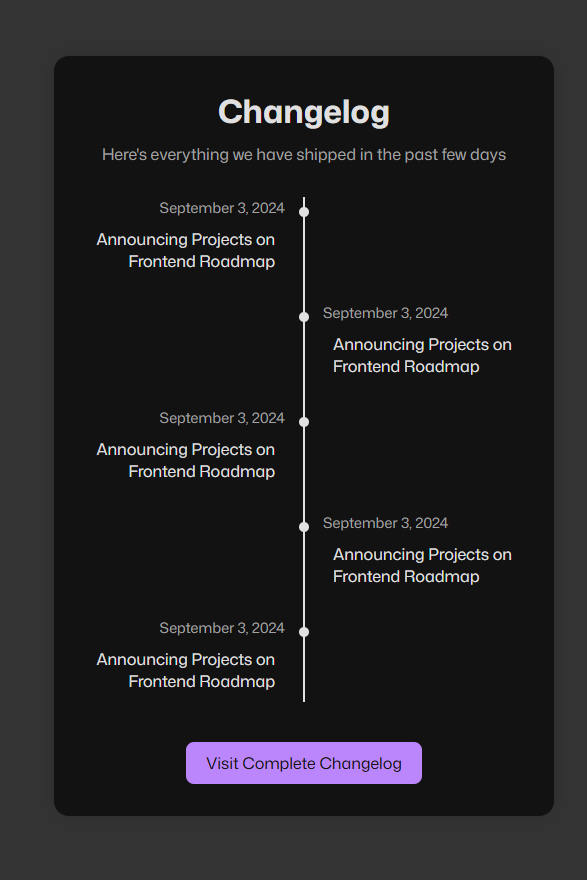

# README

Basic HTML Website
https://roadmap.sh/projects/changelog-component

# Goal

Create a simple component for a website that displays a changelog.

# ScreenShot

# Requirements

- [x] A fully styled, responsive website with the same structure as the previous project.
- [x] Consistent use of a chosen color scheme and typography.
- [x] Proper use of CSS techniques like Flexbox, media queries, and the box model.
- [x] A responsive navigation bar and well-styled contact form.

# More References

I use these resources to create such a cv projects:

1. https://www.w3schools.com/html/html5_semantic_elements.asp
2. https://www.w3schools.com/tags/tag_meta.asp
3. https://medium.com/geekculture/open-graph-tags-in-html-101-5d470bbdb78a
4. https://www.favicon.cc/
5. https://developer.mozilla.org/en-US/docs/Web/CSS
6. https://developer.mozilla.org/en-US/docs/Web/CSS/display-inside
