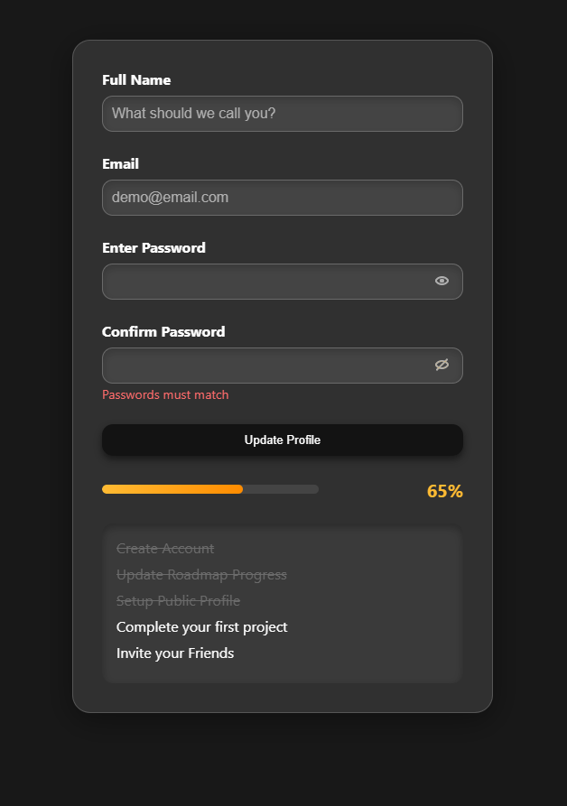

# README

https://roadmap.sh/projects/accessible-form-ui

# Goal

The goal of this project is to not only help you practice your HTML and CSS but also to focus on creating an accessible form that is easy to use for all users, including those with disabilities. 

# ScreenShot

# Accessibility Guidelines

You should read up on accessibility guidelines and best practices before starting this project. However, here are some key points to keep in mind while creating an accessible form UI:

Labeling: Ensure that each form field has a corresponding <label> element that is clearly associated with the field using the for attribute.

Focus State: Style the focus state of each input field so that users navigating with a keyboard can easily see which field is currently active.

Error Messaging: Consider adding space for error messages that can be displayed when a user inputs invalid data. These messages should be clearly associated with the relevant input field.

ARIA Attributes: Use ARIA (Accessible Rich Internet Applications) attributes where necessary, such as aria-required for required fields and aria-invalid for fields with errors.

Color Contrast: Ensure that the color contrast between text and background is sufficient to meet WCAG (Web Content Accessibility Guidelines) standards, making the form readable for users with visual impairments.

Interactive Elements: Make sure that the button to show/hide the password is accessible via keyboard and screen readers, providing clear feedback on the current state (e.g., "Password is hidden" or "Password is visible").

Once done, you can test the form UI using a screen reader or browser extensions like Axe or Lighthouse to check for accessibility issues and make necessary adjustments.