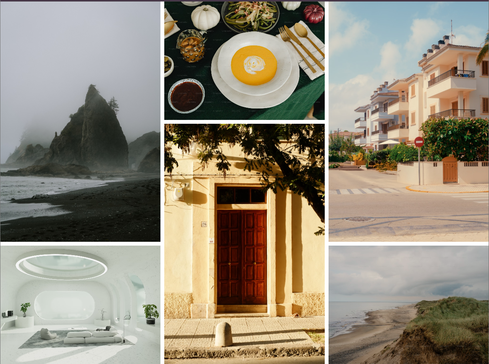

# README

https://roadmap.sh/projects/image-grid

# GOAL

The goal of this project is to give you hands-on experience with CSS Grid, allowing you to create complex layouts with ease.

# ScreenShot

# Key learning objectives of this project include:

1. Grid Structure: Understand the fundamentals of CSS Grid, including defining grid containers, rows, columns, and how to place items within the grid.

2. Responsive Design: Learn how to make the grid layout responsive so that it adapts to different screen sizes. This might involve changing the number of columns or the layout of the images based on the viewport width.

3. Alignment and Spacing: Explore how to align grid items and manage spacing between them to achieve a clean and visually appealing layout.
