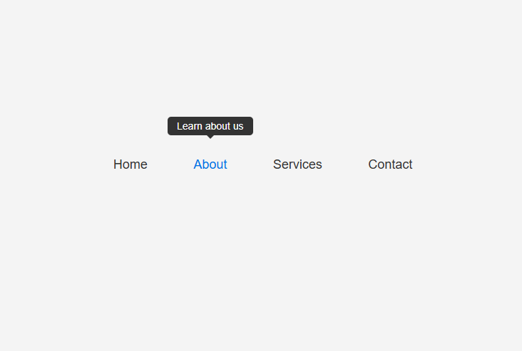

# README

https://roadmap.sh/projects/tooltip-ui

# GOAL

The goal of this project is to help you understand how to use CSS for dynamic UI effects. You will learn how to position elements relative to each other, create smooth transitions, and make your navigation more interactive and user-friendly. 

# ScreenShot

