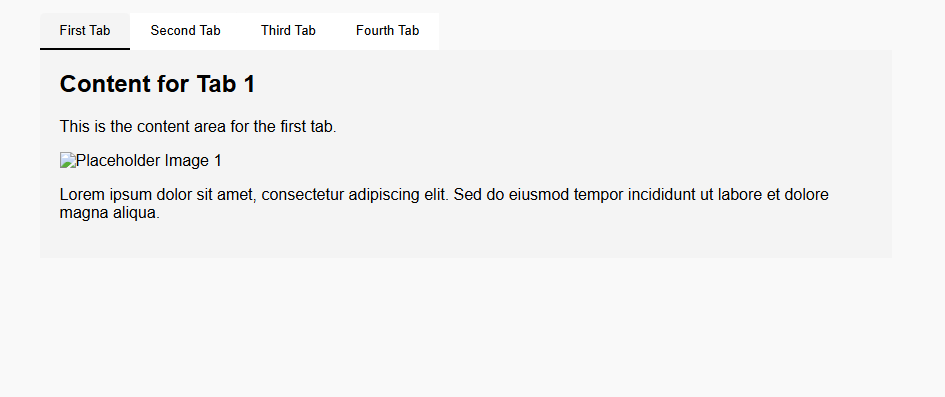

# README
 
https://roadmap.sh/projects/simple-tabs

# GOAL

The page will have four tabs, with the first tab being active by default. When the user clicks on another tab, the content of the current tab will be hidden, and the content of the selected tab will be displayed.

# ScreenShot

